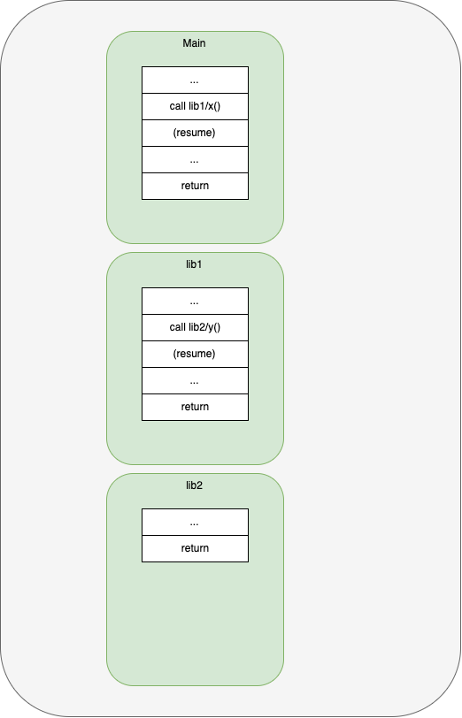
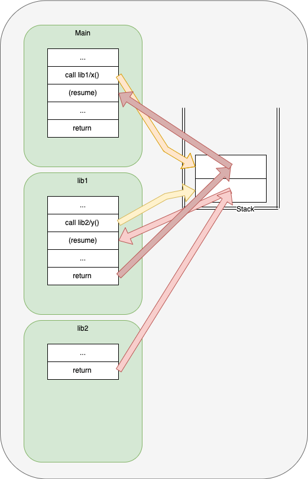

# Introduction
The software equivalent of the *von Neumann Bottleneck* is what I call the *ALGOL Bottleneck*.

The *ALGOL Bottleneck* contributes to a fiction.  It encourages programmers to hide dependencies in plain sight while creating tightly coupled programs.

Understanding the cause of the bottleneck is the first step in alleviating the problems caused by it.

## Von Neumann Bottleneck ##
The von Neumann architecture is a hardware architecture.

The von Neumann architecture uses a single hardware bus for both, code and data.

This architecture gives rise to something called the von Neumann Bottleneck.

The problem is that code cannot be fetched from memory while data is being transferred.

One of the causes of this bottleneck is the desire to unify data and code - to treat code as data.  

This view of code causes a form of deadlock.  

Code is a sequence of instructions that choreographs the operation of a machine that manipulates data. When the choreography is represented with the same data as the static data that is being manipulated, you experience a deadlock - manipulating data is the same operation as manipulating choreography scripts - you can't do both at once.  Operations need to wait until the previous operation completes, regardless if the operation was script-related or data-related.

In software, this same effect occurs through the use of a shared call-stack. 

The call-stack - a shared variable - is directly supported by modern CPU architectures. It is easy-to-use and leaks into every modern programming language.

There was a time when the callstack was not hard-wired into CPU hardware.  CALLs and COROUTINEs were considered equivalent.  

Deep analysis - quantization - of software is facilitated by treating all software as being synchronous.  The everything-must-be-deeply-analyzed-by-quantization perspective leads to synchronous software, i.e. software that is not asynchronous.  If software is written in a quantized and synchronized manner, it cannot be concurrent.  It might *appear* to be concurrent, but is not truly concurrent.  The idea of quantization is relatively new. Humanity has evolved for millenia and has learned to cope with asynchronous entitites, e.g. independent people, independent organizations, all acting concurrently, e.g. shaking hands, clinking glasses, waiting for people to show up to a meeting, not waiting for people to show up to a meeting, sketching concepts on napkins and whiteboards where figures represent concurrent entities, etc.  Adopting the perspective of using synchronized quantum steps to analyze behaviour is a skill that is not common, and, requires special training.  Not all problems need to be solved at this level of detail, to make the solutions usable.

Other hardware architectures repair this problem by using multiple buses.  

Other hardware architectures allow simultaneous transfer of data and code.

# Can Programming Be Liberated From The von Neumann Style

A famous paper "Can Programming Be Liberated from the von Neumann Style?: a Functional Style and its Algebra of Programs"[^fn1] purports to discuss this problem, but, relies on synchronous quantization.

# Fiction vs. Reality #

## Fiction: Libraries are Independent ##

How Programmers Think About Libraries

## Reality: Libraries Share A Global Variable ##

How Libraries Actually Work

The stack is a data structure.

The stack is a global variable.

The stack is shared by all functions.

The stack records dynamic call history.

The stack records a dynamic dependency chain between functions.

## Stackless 2022++ Programming
Shared Stacks can be used to choreograph control flow on single CPUs, but, make it difficult to choreograph control flow between distributed CPUs, since it is impractical to share stacks between distributed CPUs.

In 2022++, we are increasingly interested in choreographing distributed computer systems, e.g, internet, blockchain, IoT, robotics, Arduinos, Raspberry PIs, etc.

[^fn1]: https://dl.acm.org/doi/10.1145/359576.359579