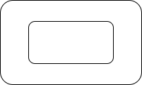
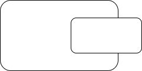

# Diagrams

People reading diagrams naturally expect isolation and concurrency. 

I view textual programs as a *subset* of DaS programs.  

DaS means *diagrams as syntax*.  FYI - DaS is not VPL[^vpl].

DaS is a hybrid of *diagrams* and *text*.  

Textual programs are a part of DaS.  Text is what you have left over when you strip out all of the diagrams.

One doesn't parse text programs to draw diagrams, one parses diagrams to produce text programs.

Textual programs simulate diagrams by using *scoping*.  In my view, `{ ... }` is ASCII Art for `box`.

## Containment

We draw diagrams of boxes contained in other boxes.

We tend not to draw diagrams of boxes that overlap.

Yet, using text-only notation, programmers routinely constructed overlapping entities.  We even gave the phenomenon a name - *global variables*[^structured].

[^structured]: Structured Programming is another example of textual solutions to overlapping boxes.

[^vpl]: Visual Programming Languages

I describe the building of diagram compilers elsewhere.

Harel's StateCharts show a simple - diagrammatic - solution to the problem of constraining *state*.

In a [follow-on paper](https://www.wisdom.weizmann.ac.il/~harel/SCANNED.PAPERS/SemanticsofStatecharts.pdf), Harel shows how to treat StateCharts in a mathematical manner (if one desires this kind of treatment).

#statecharts 
