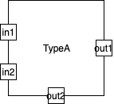

Title: Box-and-Arrow PL For Concurrency  
Author: Paul Tarvydas

# Introduction #

In this essay, I discuss the design of a box-and-arrow diagram language (PSL)[^fn1] that describes a system of concurrent, isolated software components.  

Software components are drawn as boxes and event-flows[^fn2] between the components are drawn as arrows.

I treat the diagrams as a syntax for a PSL.

The diagram language is based on a set of conventions.  N.B. programming languages are, also, based on conventions - you can't get them to compile just any English phrase.  The language manual tells you what phrases are acceptable.  Similarly, our diagram language manual (this essay) tells you what phrase are acceptable.

The language in this essay uses ASCII + boxes + lines.  And, it allows these gratoms to overlap[^fn3]

# Goal #

The goal of this language (PSL)[^fn4] is to describe software components and events flowing between them.

# Isolation #

Isolation means:

* components cannot share memory
* components cannot share control flow
* all components are asynchronous - they cannot rely on running in a specific order, except through explicit design, e.g. through the use of an explicitly designed/drawn handshake protocol

# Concurrency #

* (See my essay "Concurrency is not Parallelism" which was derived from Rob Pike's talk with the same name).
* concurrent components cannot rely on order of execution
* concurrent components cannot share control flow
* concurrent components are scheduled and executed by a single routine, which I call the dispatcher()
* analogy: web workers that communicate solely via messages
* concurrent components can be the basis of a parallel system, if the problem requires parallelism
* concurrency does not imply parallelism - a system can be built using the concurrent paradigm and run on non-parallel hardware 
* See my essay "Call / Return Spaghetti, for reasons to use the concurrent paradigm (in non-parallel and parallel situations).

# Events #

* represented as directed lines (arrows)
* one-way only

# Components #

* boxes
* input ports
* output ports
* kind
* all components are isolated
* all components are concurrent
* all components are asynchronous - they cannot rely on running in a specific order, except through explicit design, e.g. through the use of an explicitly designed/drawn handshake protocol
* components cannot share memory
* components cannot share control flow

       

# Leaf Components #

* leaf components are implementations in some other language
* leaves could use existing PLs
* leaves could use other diagram PSLs, e.g. Hierarchical State Machines

# Composite Components #

* aka Schematics
* composed, recursively, of box-and-arrow components
* "busy" if any child component is busy
* component can Send() its input events to its children and/or directly to one of its own output pins

# Input Event Queues #

* each component has one (1) input queue
* queue contains events (tag + data) 
* any component can process only one event at a time
* a component is "busy" while it is processing an input event
* component can react to an input event by generating 0 or more output events

# Output Event Queues #

* each component has one (1) output queue
* while processing an input event, a component can Send() 0 or more output events
* generated output events are queued on the output queue with an output-pin tag and data
* the output queue is processed (by the dispatcher) at any time after a component has finished processing a single input event

# Input Pins #

* a component can have 0 or more input "pins" - input ports tagged with a name (symbol, index, etc.)

# Output Pins #

A component can have 0 or more output "pins" - input ports tagged with a name (symbol, index, etc.).

# Details #

## Input Event Delivery ##

* the dispatcher() routine distributes events and invokes components
* all components, when finished processing a single event, return control back to the dispatcher()
* a component is ready if it has at least one input event in its input queue and if it is not busy
* leaf components are busy only when they are processing an event ; on a single-threaded system, this means that leaf components appear always to be not busy
* composite components are busy if any of their children are busy (recursively)
* the dispatcher() contains an unordered list of all components on that processor
* the dispatcher() visits every component in the system and, if the component is ready, the dispatcher() pulls one (1) event off of that component's input queue and invokes the component with that event, if a component is not busy the dispatcher() does not invoke it (and moves on to examining the next component)
* there is one (1) dispatcher() per processor
* parallel dispatching() is done in a recursive manner - a top-level, parallel dispatcher metes out "work" to dispatchers() on parallel processors, then spawns sub-dispatchers (one on each processor)

## Output Event Delivery ##

* the dispatcher() distributes events from the output queue of finished components (when event distribution occurs is indeterminate, we guarantee only that output events are distributed only after a component has finished processing - e.g. the dispatcher() could choose to distribute all output events from a component as soon as the component has finished processing, or, the dispatcher() could invoke many components and, only later, distribute output events)
* output events are queued up on the output queue of the Send()ing component with the output pin tag of that component plus data
* output events are translated into input events by changing the pin tag (from the output pin tag of the Send()er to the input pin tag of the receiver)
* output pins can be connected to zero (0) input pins of other components, or,
* output pins can be connected to exactly one (1) input pin of another component, or,
* output pins can be connected to more than one (>1) input pins of components (the data contained in the event is immutable, the receiver must copy the data)
* output pins can be connected to input pins of the same component

## Dropping (Skipping) Events ##

* any output event that is connected to an output pin, that is not connected to other input pins, is dropped and ignored
* components cannot rely on how they've been connected to other components

## Event Delivery Guarantees ##

The system guarantees only that an output event sent to multiple receivers is delivered "at the same time" to all receivers.

This implies that the dispatcher() follows the following protocol for delivering an output event:

* pop event from output queue of Send()er
* examine / get routing table (in parent of Send()er)
* lock input queues of associated receivers
* for every receiver:
    * create a new event
    * translate output pin tag to receiver-relative input pin tag, in new event
    * copy data[^fn5] from output event to new event
    * push new event onto input queue of receiver
* discard, GC,[^fn6] output event
* unlock input queues of associated receivers.

Obviously, the lock-time determines the throughput of the system.  This is a matter for Optimization Engineering.  It is probably problem-specific.  One solution does not fit all.  

Digital hardware works this way.  A system that is still locked when new inputs arrive is said to "over-run".  It is, also, deemed to be "too slow" to solve a particular problem.  The definition of slow-ness depends on the problem and cannot be easily generalized.  Production Engineering[^fn7] can worry about whether a penny can be saved by using slower components and avoiding over-kill (over-design) for a particular problem.

## Top Level Component ##

* a component at the top level has exactly 0 input pins and exactly 0 output pins
* a system can have 1 or more top level components
* events "from the outside world" are collected by a top level component and distributed to its children
* analogy: this is very similar in function to a window event loop, every box-and-arrow system is a system of concurrent components that reacts to events from the top level
* all other components must have at least one (1) input pin

## Bottom Level Component ##

* a bottom level component has exactly 0 output pins
* a bottom level component is executed solely for its side effect (e.g. controlling a piece of hardware) - this[^fn8] is OK, because all components are isolated

## Mid-Level Component ##

* mid-level components have at least one (1) input pin and at least one (1) output pin
* mid-level components can be leaf components or composite components

## Namespaces - Name Clashes ##

* all input pins for one component must each have unique names
* all output pins for one component must each have unique names
* input pin names can be the same as output pin names (input pins and output pins are in different namespaces)

## Long-Running Loops ##

* long running loops are not allowed - this is a bug
* long running (deep) recursion is not allowed - this is a bug

## Data in Events ##

* the system makes no guarantees about the data in an event (other than it, or a pointer to it, can be contained in the data field of an event)
* data is designed in a hierarchical manner - the Send()er and the receiver must agree on the shape of the data
* the system knows only that an event contains a pin tag and a data field
* input pin tags refer to the input port names of a receiving component
* output pin tags refer to the output port name of the Send()ing component
* the dispatcher() maps output pin tags to input pin tags

Example: UNIX® pipelines.  Events in a pipeline are lines of characters terminated by '\n' (0x0a).  End of file is 0x04.  No other structuring is implied.  Some programs, e.g. awk, assume and create fields within the lines of characters.  UNIX® does not control this interpretation of the data, it simply delivers events as whole lines (or as EOF).

Example: network protocols, e.g. OSI 7-layer.  Each layer treats packets of bytes.  The bottom-most layers key on certain bytes at the beginning and end of packets, but don't impose further structure on the contents of the packets.

Example: FBP[^fn9] sends IPs through the system.  The FBP system recognizes bracketed IPs, but imposes no further structure on the data contained in the IPs.

## Dispatching / Routing Events ##

* I talk about events travelling along wires between parts - language borrowed from digital electronics.  In this language, wires are lines (event flows), parts are components, schematics are composite components
* wires are always explicitly drawn on a schematic
* wires are fixed and never routed dynamically[^fn10]
* events are alway Send()t to a component's output queue - only the parent can route output events of a child component[^fn11]
* the routing table for events is scoped - a parent contains only the routing information between its direct children
* the implementation of wires is unrestricted
    * wires can be represented as routing tables, or,
    * wires can be represented as inline code, or,
    * …

## Measurement ##

* each component is characterized by the amount of memory that it consumes
    * amount of memory is: static memory plus (+) heap memory plus (+) stack memory[^fn12]
* each component is characterized by its worst-case throughput rate
* a system is characterized by its throughput rate for:
    * one-to-one output events
    * one-to-many output events
    * overhead incurred by running the dispatcher()
* we should be able to do a worst-case analysis of throughput of a completed system using simple math - for example, if component A Sends() a 1:1 output to component B, then the system throughput is: worst-case-throughput(A) + worst-case-throughput(B) + system-system-throughput-for-one-event + system-overhead-for-dispatcher.[^fn13]

## Control Events ##

In general, a component Send()s control events to its children.

## Data Events ##

In general, a component Send()s data events to its parent (for further routing by the parent).

## Trigger Events ##

Some events are sent only for their effect - the data value doesn't matter, only the fact that the event arrived matters.  

I call these triggers.[^fn14]

Triggers are even "smaller" than Booleans.  Triggers don't have a value.

[^fn1]: Problem-Specific Language

[^fn2]: aka data flows

[^fn3]: Whereas most textual languages don't allow characters to overlap.

[^fn4]: Problem Specific Language - a kind of DSL (Domain Specific Language)

[^fn5]: Question: if the data is non-scalar, is it copied (by value) or is only it pointer copied (by reference)?  I don't know.  The answer probably depends on the problem space.  One solution does not fit all.

[^fn6]: Garbage Collect

[^fn7]: See my essay "Roles for Software Engineering".

[^fn8]: side-effects are OK when components are fully isolated

[^fn9]: Flow-based Programming.

[^fn10]: self-modifying code is not allowed ; see digital electronics circuits' sockets for alternate ways to view dynamic construction

[^fn11]: Children components can only "see" their own output ports, and cannot name the receiving components directly.  Children Send() outputs to their own output ports.  The dispatcher() distributes output events (later), according to the routing table contained in the parent component.

[^fn12]: Unbounded recursion is a bug.

[^fn13]: N.B. for preemption-based systems (e.g Linux, Windows, MacOSX, etc.), this worst-case analysis is so bad, that the numbers are not published and/or ignored, in general.  The analysis is, also, overly-complicated for such systems.

[^fn14]: Influenced by digital hardware design.